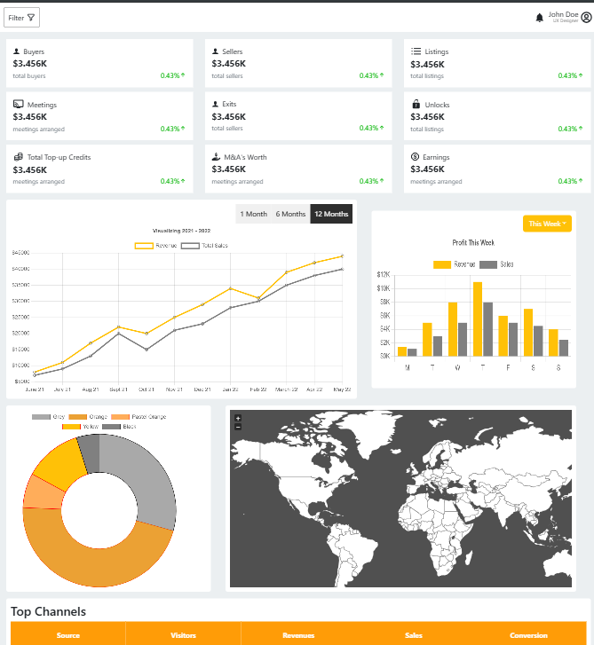

### Dashboard

       
    
 
      A tool which parses information from a resume using natural language processing and finds the keywords, cluster them onto sectors based on their keywords. 
      And lastly show recommendations, predictions, analytics to the applicant / recruiter based on keyword matching.
    

